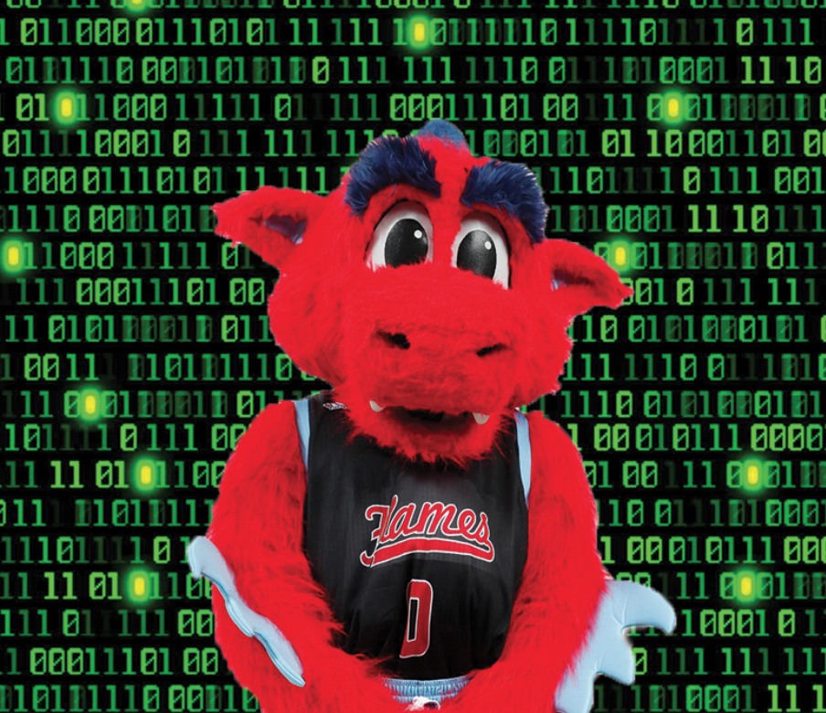

# Zusammen

Web application designed for connecting UIC students. Users create a profile, including name, major, hobbies, year of school, and residence hall if living on campus. Users can find other users with similar interests, by viewing a graph of with other users as nodes. The distance between the user's node and the nodes of other users is determined by similarities in the information in their profiles. The closer the distance, the more they have in common. Clicking on another user's node will bring up that user's profile.

Application made using ASP.net framework.

## Created by SparkHack-2023-The-Last-Codebenders
### Team Members:

- William Shepelak
- Carmen Thom
- Chris Wood
- Eli George

